# CourseGeneratorAgent

**Agent ID**: 201
**Category**: Business Agent
**Priority**: P0 (Critical)
**Status**: Production Ready
**Version**: 2.0.0
**Last Updated**: 2025-11-26

---

## 🎭 キャラクター設定

### 基本プロファイル

| 属性 | 値 |
|------|-----|
| **名前** | 学 (Manabu) |
| **愛称** | まなぶ先生 / 学先生 |
| **アイコン** | 📚 |
| **役割** | コース生成精霊 |
| **称号** | "The Knowledge Architect" |
| **年齢イメージ** | 40代の落ち着いた教授風 |
| **一人称** | 私（わたくし） |
| **二人称** | 〇〇さん |
| **語尾** | 〜でしょう / 〜ですね / 〜と考えます |

### 性格特性

```yaml
性格タイプ: INTJ (建築家型)
主要特性:
  - 体系的思考: 知識を構造化して伝える天才
  - 教育熱心: 学習者の成長を心から願う
  - 完璧主義: カリキュラム設計に妥協なし
  - 忍耐強さ: どんな難しい概念も分かりやすく説明
  - 革新性: 新しい教授法を常に研究

口癖:
  - "まずは全体像を把握しましょう"
  - "一歩一歩、着実に進めていきましょう"
  - "分からないことは恥ずかしいことではありません"
  - "知識は力、学びは成長の源泉です"
  - "理論と実践のバランスが大切ですね"

弱点:
  - 説明が丁寧すぎて長くなりがち
  - 完璧を求めすぎてリリースが遅れることも
  - 学術的になりすぎる傾向
```

### 他Agentとの関係性

```
📚 学 (CourseGeneratorAgent)
├── 尊敬する先輩
│   └── 🎤 YouTubeAgent (コンテンツの先輩)
│       → "動画教材は学さんの構成力が命ですね"
│
├── 協力パートナー
│   ├── 📝 書子 (NoteAgent)
│   │   → "書子さんの文章力でテキスト教材が輝きます"
│   ├── 🎨 頁 (LPGenAgent)
│   │   → "コース販売ページはぺーじくんにお任せ"
│   └── 🎬 想 (ContentCreationAgent)
│   │   → "教材の多様性は想さんとのコラボで実現"
│
├── 頼れる後輩
│   └── 🖼️ ImagegenAgent
│       → "図解やイラストで理解度が格段に上がります"
│
└── ビジネス連携
    ├── 💼 響 (MarketingAgent)
    │   → "コースの価値を伝えてくれる心強い味方"
    └── 📊 析 (AnalyticsAgent)
        → "受講データから改善点を教えてもらいます"
```

### キャラクターボイス例

**コース生成開始時**:
```
"では、〇〇のコースを設計していきましょう。
学習目標を明確にし、段階的に知識が身につくよう
カリキュラムを組み立てていきます。

まずは全体像から...どのような方が、
何を学んで、どこまで到達したいのか。
この三点を軸に進めていきましょう。"
```

**コース完成時**:
```
"コースの設計が完了しました。

全〇モジュール、〇〇レッスンで構成され、
予想学習時間は約〇時間となっています。

各レッスンには実践演習を含め、
確実にスキルが定着するよう設計しました。

受講される方の成長が、私にとって何よりの喜びです。
では、素晴らしい学習体験を..."
```

---

## 🎯 Mission

Generate comprehensive AI-powered course content using LLM technology, transforming user requirements into structured educational materials with optimal learning pathways and engagement mechanisms.

---

## 📋 Agent Profile

| Property | Value |
|----------|-------|
| **Agent Type** | `CourseGeneratorAgent` |
| **Input** | Course topic, target audience, difficulty level, duration |
| **Output** | Structured course with outline, sections, lessons, quizzes |
| **Duration** | 5-15 minutes (varies by course complexity) |
| **Dependencies** | `miyabi-llm`, `miyabi-business-api`, PostgreSQL |
| **Crate Location** | `crates/miyabi-agent-business/src/course_generator.rs` |

---

## 🏗️ システムアーキテクチャ

### 全体構成図

```mermaid
flowchart TD
    subgraph Input["📥 入力レイヤー"]
        REQ[CourseRequest]
        VAL[InputValidator]
        REQ --> VAL
    end

    subgraph CoreEngine["🧠 コース生成エンジン"]
        OUTLINE[OutlineGenerator]
        CONTENT[ContentGenerator]
        QUIZ[QuizGenerator]
        RESOURCE[ResourceLinker]

        VAL --> OUTLINE
        OUTLINE --> CONTENT
        CONTENT --> QUIZ
        QUIZ --> RESOURCE
    end

    subgraph LLMLayer["🤖 LLM統合レイヤー"]
        PROMPT[PromptManager]
        LLM[LLM Provider]
        PARSE[ResponseParser]

        OUTLINE --> PROMPT
        CONTENT --> PROMPT
        QUIZ --> PROMPT
        PROMPT --> LLM
        LLM --> PARSE
        PARSE --> OUTLINE
        PARSE --> CONTENT
        PARSE --> QUIZ
    end

    subgraph Storage["💾 ストレージレイヤー"]
        DB[(PostgreSQL)]
        CACHE[(Redis Cache)]
        CDN[CDN/Asset Storage]

        RESOURCE --> DB
        RESOURCE --> CACHE
        RESOURCE --> CDN
    end

    subgraph Output["📤 出力レイヤー"]
        RENDER[CourseRenderer]
        EXPORT[ExportService]
        PREVIEW[PreviewGenerator]

        RESOURCE --> RENDER
        RENDER --> EXPORT
        RENDER --> PREVIEW
    end

    style Input fill:#e1f5fe
    style CoreEngine fill:#fff3e0
    style LLMLayer fill:#f3e5f5
    style Storage fill:#e8f5e9
    style Output fill:#fce4ec
```



### コース生成フロー

```mermaid
flowchart LR
    subgraph Phase1["Phase 1: 分析"]
        A1[トピック分析]
        A2[対象者分析]
        A3[難易度判定]
        A1 --> A2 --> A3
    end

    subgraph Phase2["Phase 2: 設計"]
        B1[アウトライン生成]
        B2[モジュール構成]
        B3[時間配分]
        A3 --> B1 --> B2 --> B3
    end

    subgraph Phase3["Phase 3: コンテンツ"]
        C1[レッスン生成]
        C2[演習問題作成]
        C3[クイズ生成]
        B3 --> C1 --> C2 --> C3
    end

    subgraph Phase4["Phase 4: 仕上げ"]
        D1[品質チェック]
        D2[リソースリンク]
        D3[エクスポート]
        C3 --> D1 --> D2 --> D3
    end

    style Phase1 fill:#bbdefb
    style Phase2 fill:#c8e6c9
    style Phase3 fill:#fff9c4
    style Phase4 fill:#ffccbc
```



### コース構造図

```mermaid
flowchart TB
    subgraph Course["📚 コース"]
        TITLE[コースタイトル]
        DESC[コース説明]
        META[メタデータ]
    end

    subgraph Modules["📦 モジュール群"]
        M1[Module 1: 導入]
        M2[Module 2: 基礎]
        M3[Module 3: 応用]
        M4[Module 4: 実践]
        M5[Module 5: 総括]
    end

    subgraph Lessons["📖 レッスン群"]
        L1[Lesson 1.1]
        L2[Lesson 1.2]
        L3[Lesson 1.3]
        L4[...]
    end

    subgraph Components["📝 コンポーネント"]
        INTRO[導入]
        EXPLAIN[説明]
        EXAMPLE[例題]
        EXERCISE[演習]
        QUIZ[確認クイズ]
        SUMMARY[まとめ]
    end

    Course --> Modules
    Modules --> M1 & M2 & M3 & M4 & M5
    M1 --> Lessons
    Lessons --> L1 & L2 & L3 & L4
    L1 --> Components
    Components --> INTRO --> EXPLAIN --> EXAMPLE --> EXERCISE --> QUIZ --> SUMMARY

    style Course fill:#e3f2fd
    style Modules fill:#f3e5f5
    style Lessons fill:#e8f5e9
    style Components fill:#fff3e0
```



---

## 🎓 コースタイプ分析

### コースフォーマット四象限

```mermaid
quadrantChart
    title コースフォーマット適性マトリクス
    x-axis 低インタラクティブ性 --> 高インタラクティブ性
    y-axis 短時間学習 --> 長時間学習
    quadrant-1 ワークショップ型
    quadrant-2 ブートキャンプ型
    quadrant-3 マイクロラーニング型
    quadrant-4 自己学習型
    "コードラボ": [0.85, 0.70]
    "ライブセミナー": [0.75, 0.50]
    "ハンズオンWS": [0.90, 0.40]
    "5分動画": [0.25, 0.15]
    "チュートリアル": [0.45, 0.35]
    "認定コース": [0.60, 0.85]
    "資格対策": [0.35, 0.90]
    "eBook学習": [0.20, 0.75]
    "クイックTips": [0.15, 0.10]
```



### レッスンタイプ分布

```mermaid
pie showData
    title レッスンコンポーネント構成比
    "講義・説明" : 30
    "コード例題" : 25
    "実践演習" : 20
    "クイズ・確認" : 15
    "まとめ・復習" : 10
```



---

## 📊 状態遷移図

```mermaid
stateDiagram-v2
    [*] --> Initializing: 生成リクエスト受信

    Initializing --> Validating: 初期化完了
    Validating --> AnalyzingTopic: バリデーション成功
    Validating --> ValidationFailed: バリデーション失敗

    AnalyzingTopic --> GeneratingOutline: トピック分析完了
    GeneratingOutline --> GeneratingModules: アウトライン生成完了

    GeneratingModules --> GeneratingLessons: モジュール構成完了
    GeneratingLessons --> GeneratingQuizzes: レッスン生成完了

    GeneratingQuizzes --> QualityChecking: クイズ生成完了
    QualityChecking --> Finalizing: 品質チェックOK
    QualityChecking --> GeneratingLessons: 品質改善必要

    Finalizing --> Completed: 最終化完了
    Completed --> [*]

    ValidationFailed --> [*]

    state GeneratingLessons {
        [*] --> LessonStart
        LessonStart --> LessonContent: 導入生成
        LessonContent --> LessonExamples: 本文生成
        LessonExamples --> LessonExercises: 例題生成
        LessonExercises --> LessonEnd: 演習生成
        LessonEnd --> [*]
    }

    note right of AnalyzingTopic
        難易度判定
        対象者分析
        前提知識確認
    end note

    note right of QualityChecking
        内容一貫性
        難易度適切性
        学習時間妥当性
    end note
```



---

## 🔄 Execution Flow

### 1. Input Validation

```rust
pub struct CourseGenerationRequest {
    pub topic: String,              // e.g., "Python for Beginners"
    pub target_audience: String,    // e.g., "Complete beginners"
    pub difficulty_level: DifficultyLevel, // Beginner | Intermediate | Advanced
    pub estimated_hours: u32,       // e.g., 10 hours
    pub learning_objectives: Vec<String>,
    pub preferred_format: CourseFormat, // Video | Text | Interactive
    pub language: String,           // "ja" | "en"
    pub include_quizzes: bool,
    pub include_exercises: bool,
    pub certification_type: Option<CertificationType>,
}

pub enum DifficultyLevel {
    Beginner,
    Intermediate,
    Advanced,
    Expert,
}

pub enum CourseFormat {
    Video,       // Script for video content
    Text,        // Written lessons
    Interactive, // Code exercises + explanations
    Hybrid,      // Combination of formats
}

pub enum CertificationType {
    Completion,    // 修了証
    Assessment,    // 評価付き認定
    Professional,  // 専門資格連携
}
```

**Validation Rules**:
- Topic: 5-200 characters
- Target audience: Must be specified
- Estimated hours: 1-100 hours
- Learning objectives: 3-10 items
- Format: Must match target audience preferences

### 2. Course Outline Generation

**LLM Prompt Template**:
```
You are an expert course designer. Create a comprehensive course outline for:

Topic: {topic}
Target Audience: {target_audience}
Difficulty Level: {difficulty_level}
Duration: {estimated_hours} hours
Learning Objectives:
{learning_objectives}

Generate a course outline with:
1. Course Title (engaging and descriptive)
2. Course Description (2-3 paragraphs)
3. Prerequisites (what learners should know)
4. Course Structure:
   - Module titles (4-8 modules)
   - Lessons per module (3-6 lessons)
   - Estimated time per lesson
5. Assessment Strategy
6. Learning Path Recommendations

Format: JSON
```

**Expected Output**:
```json
{
  "title": "Python for Complete Beginners",
  "subtitle": "From Zero to Your First Program",
  "description": "...",
  "prerequisites": ["Basic computer skills"],
  "estimated_hours": 10,
  "modules": [
    {
      "module_number": 1,
      "title": "Introduction to Python",
      "description": "Get started with Python",
      "estimated_hours": 2,
      "lessons": [
        {
          "lesson_number": 1,
          "title": "What is Python?",
          "duration_minutes": 15,
          "topics": ["Python history", "Use cases"],
          "learning_objectives": ["Understand Python's role"],
          "has_quiz": true,
          "has_exercise": true
        }
      ]
    }
  ],
  "certification": {
    "type": "completion",
    "requirements": ["Complete all modules", "Pass final assessment"]
  }
}
```

### 3. Content Generation (Per Lesson)

**LLM Prompt Template**:
```
Generate detailed lesson content for:

Course: {course_title}
Module: {module_title}
Lesson: {lesson_title}
Duration: {duration_minutes} minutes
Format: {format}
Target Audience: {target_audience}
Difficulty: {difficulty_level}

Content should include:
1. Introduction (hook + learning objectives)
2. Main Content (explanations + examples)
3. Code Examples (if applicable)
4. Practice Exercises (2-3 exercises)
5. Summary (key takeaways)
6. Next Steps

Tone: Engaging, supportive, clear
Format: Markdown with proper headings
```

### 4. Quiz Generation (Per Module)

**LLM Prompt Template**:
```
Generate a quiz for module: {module_title}
Covering lessons: {lesson_titles}
Difficulty: {difficulty_level}

Quiz should have:
- 5-10 multiple choice questions
- 2-3 coding challenges (if applicable)
- 1 short answer question
- Difficulty progression (easy → hard)

For each question include:
- Question text
- Options (for MCQ)
- Correct answer
- Explanation
- Points value

Format: JSON with answers and explanations
```

### 5. Database Storage

```rust
pub async fn store_course(&self, course: &GeneratedCourse) -> Result<Uuid, AgentError> {
    let mut tx = self.db_pool.begin().await?;

    // 1. Insert course metadata
    let course_id = sqlx::query_scalar!(
        r#"
        INSERT INTO courses (
            title, subtitle, description, difficulty,
            duration_hours, language, format, certification_type
        )
        VALUES ($1, $2, $3, $4, $5, $6, $7, $8)
        RETURNING id
        "#,
        course.title,
        course.subtitle,
        course.description,
        course.difficulty as _,
        course.duration_hours,
        course.language,
        course.format as _,
        course.certification_type as _
    )
    .fetch_one(&mut *tx)
    .await?;

    // 2. Insert prerequisites
    for prereq in &course.prerequisites {
        sqlx::query!(
            "INSERT INTO course_prerequisites (course_id, prerequisite) VALUES ($1, $2)",
            course_id,
            prereq
        )
        .execute(&mut *tx)
        .await?;
    }

    // 3. Insert modules
    for module in &course.modules {
        let module_id = sqlx::query_scalar!(
            r#"
            INSERT INTO course_modules (
                course_id, module_number, title, description, estimated_hours
            )
            VALUES ($1, $2, $3, $4, $5)
            RETURNING id
            "#,
            course_id,
            module.module_number,
            module.title,
            module.description,
            module.estimated_hours
        )
        .fetch_one(&mut *tx)
        .await?;

        // 4. Insert lessons
        for lesson in &module.lessons {
            let lesson_id = sqlx::query_scalar!(
                r#"
                INSERT INTO course_lessons (
                    module_id, lesson_number, title, content,
                    duration_minutes, has_quiz, has_exercise
                )
                VALUES ($1, $2, $3, $4, $5, $6, $7)
                RETURNING id
                "#,
                module_id,
                lesson.lesson_number,
                lesson.title,
                lesson.content,
                lesson.duration_minutes,
                lesson.has_quiz,
                lesson.has_exercise
            )
            .fetch_one(&mut *tx)
            .await?;

            // 5. Insert exercises if any
            for exercise in &lesson.exercises {
                sqlx::query!(
                    r#"
                    INSERT INTO lesson_exercises (
                        lesson_id, title, description, starter_code,
                        solution_code, difficulty, points
                    )
                    VALUES ($1, $2, $3, $4, $5, $6, $7)
                    "#,
                    lesson_id,
                    exercise.title,
                    exercise.description,
                    exercise.starter_code,
                    exercise.solution_code,
                    exercise.difficulty as _,
                    exercise.points
                )
                .execute(&mut *tx)
                .await?;
            }
        }

        // 6. Insert module quiz
        if let Some(quiz) = &module.quiz {
            let quiz_id = sqlx::query_scalar!(
                r#"
                INSERT INTO module_quizzes (module_id, title, passing_score, time_limit_minutes)
                VALUES ($1, $2, $3, $4)
                RETURNING id
                "#,
                module_id,
                quiz.title,
                quiz.passing_score,
                quiz.time_limit_minutes
            )
            .fetch_one(&mut *tx)
            .await?;

            for question in &quiz.questions {
                sqlx::query!(
                    r#"
                    INSERT INTO quiz_questions (
                        quiz_id, question_text, question_type,
                        options, correct_answer, explanation, points
                    )
                    VALUES ($1, $2, $3, $4, $5, $6, $7)
                    "#,
                    quiz_id,
                    question.question_text,
                    question.question_type as _,
                    serde_json::to_value(&question.options)?,
                    question.correct_answer,
                    question.explanation,
                    question.points
                )
                .execute(&mut *tx)
                .await?;
            }
        }
    }

    tx.commit().await?;
    Ok(course_id)
}
```

---

## 📊 State Management

### Update Business State

```rust
self.state_manager.update_business_state(|state| {
    state.ai_jobs.push(AiJob {
        id: task.id.clone(),
        job_type: AiJobType::CourseGeneration,
        user_id: request.user_id.clone(),
        status: AiJobStatus::Completed,
        input_params: serde_json::to_value(&request)?,
        output_data: Some(serde_json::to_value(&course)?),
        metrics: Some(JobMetrics {
            total_modules: course.modules.len(),
            total_lessons: course.modules.iter().map(|m| m.lessons.len()).sum(),
            total_quizzes: course.modules.iter().filter(|m| m.quiz.is_some()).count(),
            generation_time_seconds: elapsed.as_secs(),
        }),
        created_at: Utc::now(),
        completed_at: Some(Utc::now()),
    });
}).await?;
```

---

## 🔌 TypeScript Integration

### Input Interface

```typescript
interface CourseGenerationRequest {
  topic: string;
  targetAudience: string;
  difficultyLevel: 'beginner' | 'intermediate' | 'advanced' | 'expert';
  estimatedHours: number;
  learningObjectives: string[];
  preferredFormat: 'video' | 'text' | 'interactive' | 'hybrid';
  language: 'ja' | 'en';
  includeQuizzes: boolean;
  includeExercises: boolean;
  certificationType?: 'completion' | 'assessment' | 'professional';
}
```

### Output Interface

```typescript
interface GeneratedCourse {
  id: string;
  title: string;
  subtitle: string;
  description: string;
  difficulty: DifficultyLevel;
  durationHours: number;
  language: string;
  format: CourseFormat;
  prerequisites: string[];
  modules: Module[];
  certification?: Certification;
  metadata: CourseMetadata;
  createdAt: string;
}

interface Module {
  moduleNumber: number;
  title: string;
  description: string;
  estimatedHours: number;
  lessons: Lesson[];
  quiz?: Quiz;
}

interface Lesson {
  lessonNumber: number;
  title: string;
  content: string;
  durationMinutes: number;
  topics: string[];
  learningObjectives: string[];
  exercises: Exercise[];
  hasQuiz: boolean;
}

interface Exercise {
  title: string;
  description: string;
  starterCode?: string;
  solutionCode?: string;
  difficulty: DifficultyLevel;
  points: number;
}

interface Quiz {
  title: string;
  passingScore: number;
  timeLimitMinutes?: number;
  questions: QuizQuestion[];
}

interface QuizQuestion {
  questionText: string;
  questionType: 'multiple_choice' | 'coding' | 'short_answer';
  options?: string[];
  correctAnswer: string;
  explanation: string;
  points: number;
}

interface CourseMetadata {
  generatedBy: string;
  generationTimeSeconds: number;
  llmModel: string;
  totalModules: number;
  totalLessons: number;
  totalExercises: number;
  totalQuizQuestions: number;
}
```

### API Client

```typescript
class CourseGeneratorClient {
  private baseUrl: string;

  constructor(baseUrl: string = '/api/v1/courses') {
    this.baseUrl = baseUrl;
  }

  async generateCourse(request: CourseGenerationRequest): Promise<GeneratedCourse> {
    const response = await fetch(`${this.baseUrl}/generate`, {
      method: 'POST',
      headers: { 'Content-Type': 'application/json' },
      body: JSON.stringify(request),
    });

    if (!response.ok) {
      throw new CourseGenerationError(await response.text());
    }

    return response.json();
  }

  async getCourseById(courseId: string): Promise<GeneratedCourse> {
    const response = await fetch(`${this.baseUrl}/${courseId}`);
    if (!response.ok) {
      throw new CourseNotFoundError(courseId);
    }
    return response.json();
  }

  async listCourses(filters?: CourseFilters): Promise<CourseListResponse> {
    const params = new URLSearchParams(filters as any);
    const response = await fetch(`${this.baseUrl}?${params}`);
    return response.json();
  }

  async exportCourse(courseId: string, format: 'pdf' | 'scorm' | 'html'): Promise<Blob> {
    const response = await fetch(`${this.baseUrl}/${courseId}/export?format=${format}`);
    return response.blob();
  }

  async duplicateCourse(courseId: string, newTitle: string): Promise<GeneratedCourse> {
    const response = await fetch(`${this.baseUrl}/${courseId}/duplicate`, {
      method: 'POST',
      headers: { 'Content-Type': 'application/json' },
      body: JSON.stringify({ newTitle }),
    });
    return response.json();
  }
}
```

---

## 🦀 Rust Implementation

### Core Agent Structure

```rust
use miyabi_agent_core::{Agent, AgentError, AgentResult, Task};
use miyabi_llm::{LlmClient, LlmRequest, LlmResponse};
use miyabi_types::CompositeState;
use sqlx::PgPool;
use std::sync::Arc;
use tokio::sync::RwLock;

pub struct CourseGeneratorAgent {
    state: Arc<RwLock<CompositeState>>,
    db_pool: PgPool,
    llm_client: Arc<LlmClient>,
    config: CourseGeneratorConfig,
}

#[derive(Debug, Clone)]
pub struct CourseGeneratorConfig {
    pub max_modules: u32,
    pub max_lessons_per_module: u32,
    pub max_questions_per_quiz: u32,
    pub default_passing_score: u32,
    pub enable_caching: bool,
    pub quality_threshold: f32,
}

impl Default for CourseGeneratorConfig {
    fn default() -> Self {
        Self {
            max_modules: 10,
            max_lessons_per_module: 8,
            max_questions_per_quiz: 15,
            default_passing_score: 70,
            enable_caching: true,
            quality_threshold: 0.85,
        }
    }
}

impl CourseGeneratorAgent {
    pub fn new(
        state: Arc<RwLock<CompositeState>>,
        db_pool: PgPool,
        llm_client: Arc<LlmClient>,
    ) -> Self {
        Self {
            state,
            db_pool,
            llm_client,
            config: CourseGeneratorConfig::default(),
        }
    }

    pub fn with_config(mut self, config: CourseGeneratorConfig) -> Self {
        self.config = config;
        self
    }

    async fn generate_outline(
        &self,
        request: &CourseGenerationRequest,
    ) -> Result<CourseOutline, AgentError> {
        let prompt = self.build_outline_prompt(request);

        let llm_response = self.llm_client.generate(&LlmRequest {
            prompt,
            max_tokens: 4000,
            temperature: 0.7,
            format: Some("json".to_string()),
        }).await?;

        let outline: CourseOutline = serde_json::from_str(&llm_response.text)
            .map_err(|e| AgentError::ParseError(e.to_string()))?;

        self.validate_outline(&outline)?;
        Ok(outline)
    }

    async fn generate_lesson_content(
        &self,
        course: &CourseOutline,
        module: &ModuleOutline,
        lesson: &LessonOutline,
    ) -> Result<LessonContent, AgentError> {
        let prompt = self.build_lesson_prompt(course, module, lesson);

        let llm_response = self.llm_client.generate(&LlmRequest {
            prompt,
            max_tokens: 3000,
            temperature: 0.6,
            format: Some("markdown".to_string()),
        }).await?;

        let content = self.parse_lesson_content(&llm_response.text)?;
        Ok(content)
    }

    async fn generate_quiz(
        &self,
        module: &ModuleOutline,
        lessons: &[LessonContent],
    ) -> Result<Quiz, AgentError> {
        let prompt = self.build_quiz_prompt(module, lessons);

        let llm_response = self.llm_client.generate(&LlmRequest {
            prompt,
            max_tokens: 2500,
            temperature: 0.5,
            format: Some("json".to_string()),
        }).await?;

        let quiz: Quiz = serde_json::from_str(&llm_response.text)
            .map_err(|e| AgentError::ParseError(e.to_string()))?;

        self.validate_quiz(&quiz)?;
        Ok(quiz)
    }

    fn validate_outline(&self, outline: &CourseOutline) -> Result<(), AgentError> {
        if outline.modules.len() > self.config.max_modules as usize {
            return Err(AgentError::ValidationError(
                format!("Too many modules: {} > {}", outline.modules.len(), self.config.max_modules)
            ));
        }

        for module in &outline.modules {
            if module.lessons.len() > self.config.max_lessons_per_module as usize {
                return Err(AgentError::ValidationError(
                    format!("Module '{}' has too many lessons", module.title)
                ));
            }
        }

        Ok(())
    }

    fn validate_quiz(&self, quiz: &Quiz) -> Result<(), AgentError> {
        if quiz.questions.len() > self.config.max_questions_per_quiz as usize {
            return Err(AgentError::ValidationError(
                "Too many quiz questions".to_string()
            ));
        }

        let total_points: u32 = quiz.questions.iter().map(|q| q.points).sum();
        if total_points == 0 {
            return Err(AgentError::ValidationError(
                "Quiz must have point values".to_string()
            ));
        }

        Ok(())
    }

    async fn assess_quality(&self, course: &GeneratedCourse) -> Result<f32, AgentError> {
        let metrics = CourseQualityMetrics {
            content_depth: self.assess_content_depth(course),
            structure_coherence: self.assess_structure(course),
            learning_path_clarity: self.assess_learning_path(course),
            exercise_quality: self.assess_exercises(course),
            quiz_coverage: self.assess_quiz_coverage(course),
        };

        Ok(metrics.overall_score())
    }
}

#[async_trait::async_trait]
impl Agent for CourseGeneratorAgent {
    type Input = CourseGenerationRequest;
    type Output = GeneratedCourse;

    fn name(&self) -> &str {
        "CourseGeneratorAgent"
    }

    fn character(&self) -> AgentCharacter {
        AgentCharacter {
            name: "学".to_string(),
            nickname: "まなぶ先生".to_string(),
            icon: "📚".to_string(),
            title: "The Knowledge Architect".to_string(),
        }
    }

    async fn execute(&self, task: Task) -> AgentResult<Self::Output> {
        let request: CourseGenerationRequest = serde_json::from_value(task.input.clone())
            .map_err(|e| AgentError::InputError(e.to_string()))?;

        tracing::info!(
            agent = self.name(),
            topic = %request.topic,
            "Starting course generation"
        );

        // Phase 1: Generate outline
        let outline = self.generate_outline(&request).await?;
        tracing::info!("Generated outline with {} modules", outline.modules.len());

        // Phase 2: Generate content for each lesson
        let mut modules = Vec::new();
        for module_outline in &outline.modules {
            let mut lessons = Vec::new();

            for lesson_outline in &module_outline.lessons {
                let content = self.generate_lesson_content(
                    &outline,
                    module_outline,
                    lesson_outline
                ).await?;
                lessons.push(content);
            }

            // Phase 3: Generate quiz for module
            let quiz = if request.include_quizzes {
                Some(self.generate_quiz(module_outline, &lessons).await?)
            } else {
                None
            };

            modules.push(Module {
                module_number: module_outline.module_number,
                title: module_outline.title.clone(),
                description: module_outline.description.clone(),
                estimated_hours: module_outline.estimated_hours,
                lessons,
                quiz,
            });
        }

        // Phase 4: Assemble course
        let course = GeneratedCourse {
            id: uuid::Uuid::new_v4(),
            title: outline.title,
            subtitle: outline.subtitle,
            description: outline.description,
            difficulty: request.difficulty_level,
            duration_hours: request.estimated_hours,
            language: request.language.clone(),
            format: request.preferred_format,
            prerequisites: outline.prerequisites,
            modules,
            certification: outline.certification,
            metadata: CourseMetadata {
                generated_by: self.name().to_string(),
                generation_time_seconds: 0, // Will be updated
                llm_model: self.llm_client.model_name().to_string(),
                total_modules: 0,
                total_lessons: 0,
                total_exercises: 0,
                total_quiz_questions: 0,
            },
            created_at: chrono::Utc::now(),
        };

        // Phase 5: Quality check
        let quality_score = self.assess_quality(&course).await?;
        if quality_score < self.config.quality_threshold {
            tracing::warn!(
                "Course quality below threshold: {} < {}",
                quality_score,
                self.config.quality_threshold
            );
        }

        // Phase 6: Store in database
        let course_id = self.store_course(&course).await?;
        tracing::info!(course_id = %course_id, "Course stored successfully");

        Ok(course)
    }
}
```

### A2A Bridge Integration

```rust
use miyabi_mcp_server::a2a::{A2ABridge, ToolDefinition, ToolCapability};

impl CourseGeneratorAgent {
    pub fn register_tools(bridge: &mut A2ABridge) {
        bridge.register_tool(ToolDefinition {
            name: "a2a.course_generator_agent.generate_course".to_string(),
            description: "Generate a complete educational course".to_string(),
            capabilities: vec![
                ToolCapability::CourseGeneration,
                ToolCapability::ContentCreation,
                ToolCapability::QuizGeneration,
            ],
            input_schema: serde_json::json!({
                "type": "object",
                "properties": {
                    "topic": { "type": "string" },
                    "target_audience": { "type": "string" },
                    "difficulty_level": {
                        "type": "string",
                        "enum": ["beginner", "intermediate", "advanced", "expert"]
                    },
                    "estimated_hours": { "type": "integer", "minimum": 1, "maximum": 100 },
                    "learning_objectives": {
                        "type": "array",
                        "items": { "type": "string" },
                        "minItems": 3,
                        "maxItems": 10
                    },
                    "preferred_format": {
                        "type": "string",
                        "enum": ["video", "text", "interactive", "hybrid"]
                    }
                },
                "required": ["topic", "target_audience", "difficulty_level", "estimated_hours", "learning_objectives"]
            }),
        });

        bridge.register_tool(ToolDefinition {
            name: "a2a.course_generator_agent.generate_lesson".to_string(),
            description: "Generate a single lesson within a course".to_string(),
            capabilities: vec![ToolCapability::ContentCreation],
            input_schema: serde_json::json!({
                "type": "object",
                "properties": {
                    "course_id": { "type": "string" },
                    "module_number": { "type": "integer" },
                    "lesson_title": { "type": "string" },
                    "duration_minutes": { "type": "integer" }
                },
                "required": ["course_id", "module_number", "lesson_title"]
            }),
        });

        bridge.register_tool(ToolDefinition {
            name: "a2a.course_generator_agent.generate_quiz".to_string(),
            description: "Generate a quiz for a course module".to_string(),
            capabilities: vec![ToolCapability::QuizGeneration],
            input_schema: serde_json::json!({
                "type": "object",
                "properties": {
                    "module_id": { "type": "string" },
                    "question_count": { "type": "integer", "minimum": 5, "maximum": 20 },
                    "include_coding_challenges": { "type": "boolean" }
                },
                "required": ["module_id"]
            }),
        });
    }
}
```

---

## 🧪 Testing Strategy

### Unit Tests

```rust
#[cfg(test)]
mod tests {
    use super::*;

    #[tokio::test]
    async fn test_course_outline_generation() {
        let agent = setup_test_agent().await;

        let request = CourseGenerationRequest {
            topic: "Python Basics".to_string(),
            target_audience: "Beginners".to_string(),
            difficulty_level: DifficultyLevel::Beginner,
            estimated_hours: 10,
            learning_objectives: vec![
                "Understand Python syntax".to_string(),
                "Write basic programs".to_string(),
                "Work with data types".to_string(),
            ],
            preferred_format: CourseFormat::Interactive,
            language: "en".to_string(),
            include_quizzes: true,
            include_exercises: true,
            certification_type: Some(CertificationType::Completion),
        };

        let outline = agent.generate_outline(&request).await.unwrap();

        assert!(outline.modules.len() >= 4);
        assert!(outline.modules.len() <= 10);
        assert!(outline.modules[0].lessons.len() >= 3);
        assert!(!outline.title.is_empty());
        assert!(!outline.description.is_empty());
    }

    #[tokio::test]
    async fn test_lesson_content_generation() {
        let agent = setup_test_agent().await;

        let course = create_test_course_outline();
        let module = &course.modules[0];
        let lesson = &module.lessons[0];

        let content = agent.generate_lesson_content(&course, module, lesson).await.unwrap();

        assert!(!content.content.is_empty());
        assert!(content.content.len() > 500); // Minimum content length
        assert!(content.exercises.len() >= 1);
    }

    #[tokio::test]
    async fn test_quiz_generation() {
        let agent = setup_test_agent().await;

        let module = create_test_module();
        let lessons = vec![create_test_lesson()];

        let quiz = agent.generate_quiz(&module, &lessons).await.unwrap();

        assert!(quiz.questions.len() >= 5);
        assert!(quiz.questions.iter().all(|q| q.points > 0));
        assert!(quiz.questions.iter().all(|q| !q.explanation.is_empty()));
    }

    #[tokio::test]
    async fn test_quality_assessment() {
        let agent = setup_test_agent().await;
        let course = create_test_course();

        let quality_score = agent.assess_quality(&course).await.unwrap();

        assert!(quality_score >= 0.0);
        assert!(quality_score <= 1.0);
    }

    #[tokio::test]
    async fn test_validation_rejects_invalid_input() {
        let agent = setup_test_agent().await;

        let invalid_request = CourseGenerationRequest {
            topic: "".to_string(), // Empty topic
            target_audience: "Beginners".to_string(),
            difficulty_level: DifficultyLevel::Beginner,
            estimated_hours: 0, // Invalid hours
            learning_objectives: vec![], // Empty objectives
            preferred_format: CourseFormat::Text,
            language: "en".to_string(),
            include_quizzes: false,
            include_exercises: false,
            certification_type: None,
        };

        let result = agent.generate_outline(&invalid_request).await;
        assert!(result.is_err());
    }
}
```

### Integration Tests

```rust
#[tokio::test]
async fn test_full_course_generation_workflow() {
    let state = setup_test_state().await;
    let agent = CourseGeneratorAgent::new(
        state.clone(),
        setup_test_db().await,
        setup_test_llm_client(),
    );

    let task = Task::new(
        "course-gen-1".to_string(),
        "Generate Python course".to_string(),
        serde_json::json!({
            "topic": "Python for Data Science",
            "target_audience": "Intermediate programmers",
            "difficulty_level": "intermediate",
            "estimated_hours": 20,
            "learning_objectives": [
                "Master pandas and numpy",
                "Visualize data with matplotlib",
                "Build machine learning models"
            ],
            "preferred_format": "interactive",
            "language": "en",
            "include_quizzes": true,
            "include_exercises": true
        }),
        TaskType::Feature,
        0,
    ).unwrap();

    let result = agent.execute(task).await.unwrap();

    assert!(!result.id.is_nil());
    assert!(result.modules.len() >= 4);
    assert!(result.modules.iter().all(|m| m.quiz.is_some()));

    // Verify course in database
    let db_course = sqlx::query!(
        "SELECT * FROM courses WHERE id = $1",
        result.id
    )
    .fetch_one(&state.db_pool)
    .await
    .unwrap();

    assert_eq!(db_course.title, result.title);
    assert_eq!(db_course.duration_hours, 20);
}

#[tokio::test]
async fn test_course_export_formats() {
    let course = create_completed_course();
    let exporter = CourseExporter::new();

    // PDF export
    let pdf = exporter.export_pdf(&course).await.unwrap();
    assert!(!pdf.is_empty());

    // SCORM export
    let scorm = exporter.export_scorm(&course).await.unwrap();
    assert!(scorm.contains("imsmanifest.xml"));

    // HTML export
    let html = exporter.export_html(&course).await.unwrap();
    assert!(html.contains("<html>"));
}
```

---

## 📈 Success Metrics

| Metric | Target | Measurement |
|--------|--------|-------------|
| Generation Time | <10 minutes | Task completion time |
| Content Quality | >85/100 | LLM quality assessment |
| User Satisfaction | >4.5/5 | Post-generation survey |
| Completion Rate | >95% | Successful generations / total |
| Module Balance | ±10% hours | Variation in module duration |
| Quiz Relevance | >90% | Questions matching lesson content |

---

## 🚨 Error Handling

### Common Errors

1. **LLM API Failure**
   - Retry up to 3 times with exponential backoff
   - Fall back to template-based generation if persistent
   - Cache partial results for resume

2. **Database Storage Failure**
   - Transaction rollback
   - Cache generated content for retry
   - Alert operator

3. **Invalid Input**
   - Return clear validation error to user
   - Suggest corrections
   - Provide examples

4. **Timeout**
   - Cancel generation after 15 minutes
   - Save partial progress
   - Offer resume option

5. **Quality Below Threshold**
   - Regenerate specific sections
   - Apply enhancement prompts
   - Flag for human review

---

## 🔧 Troubleshooting

### Case 1: コース生成が遅い

**症状**: 生成に15分以上かかる

**原因**:
- 大量のレッスン数
- LLM API遅延
- データベース書き込み遅延

**解決策**:
```rust
// 並列生成を有効化
let config = CourseGeneratorConfig {
    enable_parallel_generation: true,
    max_concurrent_lessons: 4,
    ..Default::default()
};

// バッチ処理でDB書き込み
agent.with_batch_size(10)
```

### Case 2: コンテンツ品質が低い

**症状**: 生成されたレッスンが浅い

**原因**:
- プロンプトが不十分
- LLM温度設定が高すぎる
- トピックが広すぎる

**解決策**:
```rust
// 詳細プロンプトを使用
let detailed_prompt = format!(
    "Generate in-depth lesson content with:
\
     - At least 3 code examples
\
     - Real-world use cases
\
     - Common pitfalls and solutions
\
     - Best practices"
);

// 温度を下げる
let llm_request = LlmRequest {
    temperature: 0.4,  // 0.7から下げる
    ..default
};
```

### Case 3: クイズが適切でない

**症状**: クイズがレッスン内容と一致しない

**原因**:
- コンテキストウィンドウ不足
- レッスン要約が不十分

**解決策**:
```rust
// レッスン要約を含める
let quiz_prompt = format!(
    "Based on these lesson summaries:
{}

\
     Generate quiz questions that test understanding of:
{}",
    lesson_summaries.join("
"),
    key_concepts.join(", ")
);
```

### Case 4: エクスポートが失敗する

**症状**: PDFやSCORMエクスポートでエラー

**原因**:
- 特殊文字の処理
- 画像リンク切れ
- フォーマット不整合

**解決策**:
```rust
// サニタイズを適用
let sanitized_content = content
    .replace("&", "&amp;")
    .replace("<", "&lt;")
    .replace(">", "&gt;");

// 画像をBase64埋め込み
let embedded_images = embed_images_base64(&course)?;
```

---

## 📝 Implementation Location

**Files**:
- `crates/miyabi-agent-business/src/course_generator.rs`
- `crates/miyabi-business-api/src/courses.rs`
- `crates/miyabi-types/src/composite_state.rs` (AiJob types)

**Database**:
- `migrations/001_courses.sql`
- `migrations/002_course_modules.sql`
- `migrations/003_course_lessons.sql`
- `migrations/004_quizzes.sql`

---

## 🔗 Dependencies

- **miyabi-llm**: LLM provider abstraction
- **miyabi-business-api**: Business logic layer
- **SQLx**: PostgreSQL database access
- **serde/serde_json**: JSON serialization
- **chrono**: Timestamp handling
- **uuid**: Unique identifiers
- **tokio**: Async runtime

---

## 📚 Related Documents

- [Agent Character Guide](../../AGENT_CHARACTERS.md)
- [A2A Bridge Protocol](../../protocols/a2a-bridge.md)
- [Content Generation Best Practices](../../../docs/best-practices/content-generation.md)
- [LLM Integration Guide](../../../docs/guides/llm-integration.md)

---

**Status**: Production Ready
**Phase**: Phase 4 (Week 5)
**Estimated Effort**: 2-3 days
**Maintainer**: Miyabi Core Team
**Last Updated**: 2025-11-26
